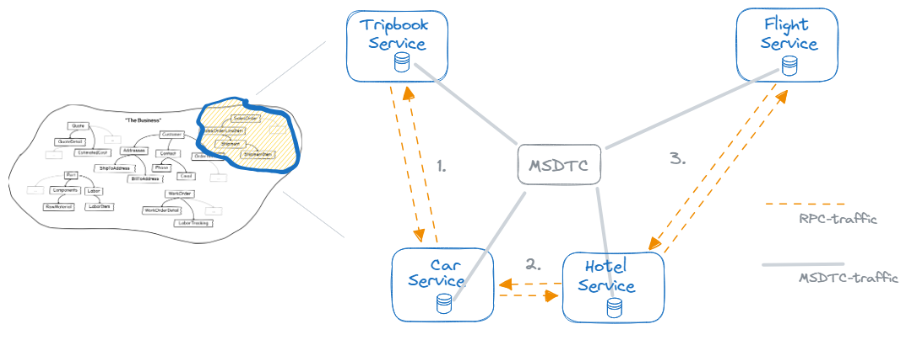
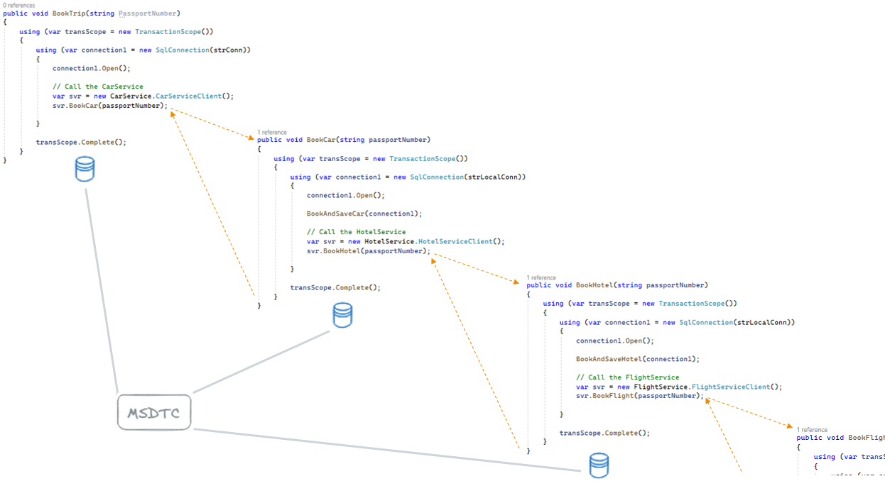
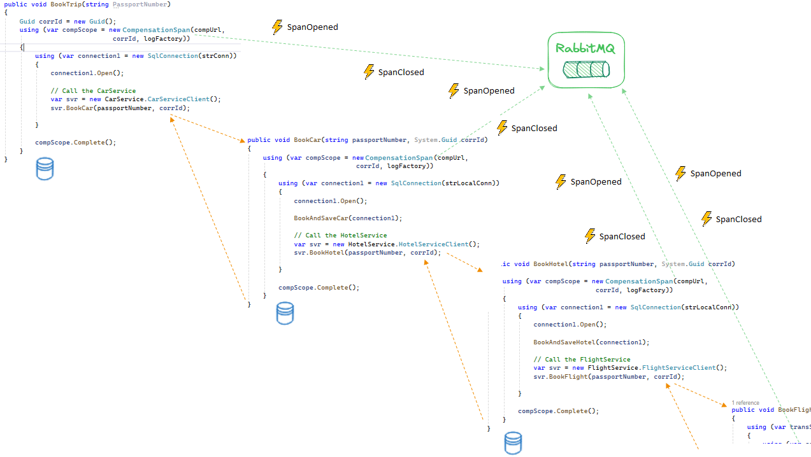
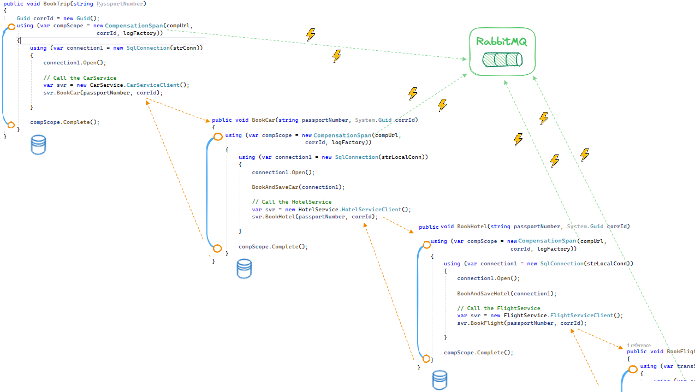
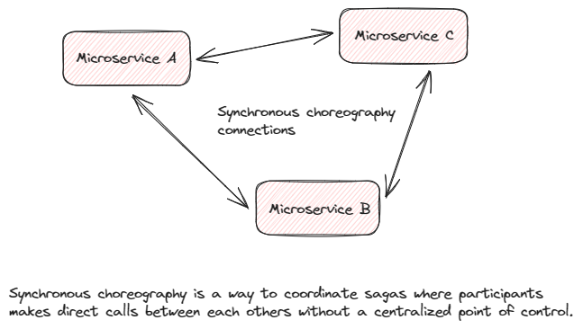
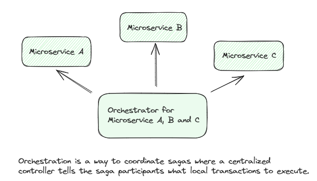
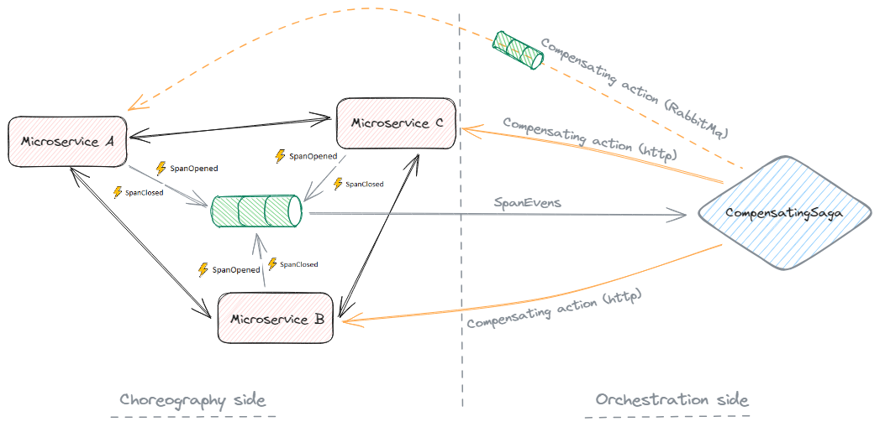
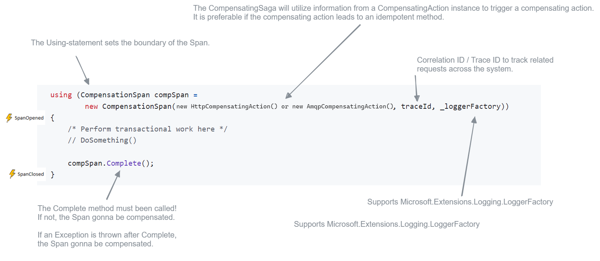

# FlowDance
FlowDance aims to address several critical aspects in the context of microservices architecture. Let's delve into each of these goals:

**Support Inter-service Communication Between Microservices (Database-per-Service Pattern)**:
    In a microservices architecture, each service often manages its own database. The **Database-per-Service Pattern** encourages this separation.
    By adopting this pattern, services can communicate with each other through well-defined APIs, avoiding direct database access.
    This approach enhances modularity, scalability, and isolation, allowing services to evolve independently.

**Replacing Distributed Transactions Calls supported by MSDTC**:
    MSDTC (Microsoft Distributed Transaction Coordinator) is commonly used for distributed transactions across multiple databases.
    However, MSDTC introduces complexity, performance overhead, and potential deadlocks.
    FlowDance proposes a shift towards synchronous RPC (Remote Procedure Call) communication.
    Services share a **Correlation ID / Trace ID** to track related requests across the system.
    Instead of distributed transactions, services coordinate their actions using synchronous calls, simplifying the architecture.
    While strong consistency is essential in some business cases, FlowDance aims to minimize the need for distributed transactions.

**Moving Away from Strong Consistency to Eventual Consistency Using the Compensating Transaction (or Compensating Action) Pattern**:
    In distributed systems, achieving strong consistency (ACID properties) across all services can be challenging.
    FlowDance embraces **eventual consistency**, where operations may temporarily yield inconsistent results.
    The **Compensating Transaction Pattern** comes into play when a step in a process fails.
    If a step cannot be fully rolled back (e.g., due to concurrent changes), compensating transactions undo the effects of previous steps.
    This pattern ensures that the system eventually converges to a consistent state, even after partial failures.

## Where you might be today?
The team(s) has been working to split the monolith or at least some steps in that direction. To uphold strong consistency the microservices use Distributed Transactions Calls supported by MSDTC.
Some services has been created using the Database-per-Service Pattern but still there are some really strong bands between the monolith and separated services due to distributed transactions and strong consistency.   



A team may already have started working with a new technology stack, maybe it is .NET Core? It’s important to note that .NET Core does not support Distributed Transaction Calls as facilitated by MSDTC. That put our team in a position where they not even can offer any type of controlled consistency if there code is a part of an overall call chain. 
It’s more fire and hope all works out as it suppose to🤞. 

In the picure below shows how easy a call chain gets created in the system. 
The user is attempting to book a trip that includes a car rental, hotel reservation, and flight.
The solution employs a microservices architecture, where each component (car, hotel, and flight) has its own dedicated microservice. These microservices are seamlessly integrated using a Distributed Transaction Coordinator (DTC) session.
If we would add an one or more services to the call chain the transactions scope would increase even more and introduces more complexity, more performance overhead, and potential deadlocks.  

So the conclusion is the Distributed Transactions with strong consistency don´t scale that easy and increase the risk of complexity, performance overhead, and potential deadlocks.



## Leaving the world of strong consistency
So how does FlowDance help us out when we still want to base our solution on synchronous RPC-Calls and use compensating transaction but leaving MSDTC behind?
Event-driven architecture is out of scoop here for a number of reasons :)

In short - by replacing **System.Transactions.TransactionScope** with **FlowDance.Client.CompensationSpan** you leaves the world of strong consistency into eventual consistency.



At the core of **FlowDance**, there is something called a **CompensationSpan**. A **CompensationSpan** carries the information for how a transaction can be compensated.
A **CompensationSpan** is initialized using the **SpanOpened** event and closed using the **SpanClosed** event. The image above shows how these two types of events are stored in RabbitMQ.

For every CompensationSpan we use in our code, we will generate two events; SpanOpened and SpanClosed. As a _user_ of the CompensationSpan you will never see this events, they are in the background.

When a SpanEvent (SpanOpened or SpanClosed) is created, it´s stored in a **RabbitMQ Stream**. A **Stream** is a persistent and replicated data structure that models an append-only log with non-destructive consumer semantics. 
Unlike traditional queues, which delete messages once consumed, streams allow consumers to attach at any point in the log and read from there. They provide a powerful way to manage and process messages efficiently. 🐰📜

The initial CompensationSpan is called the Root Span, and it serves as the starting point for subsequent calls. Subsequent CompensationSpans share the same Correlation ID / Trace ID as the Root Span.

In the image below, we have replaced `System.Transactions.TransactionScope` with `FlowDance.Client.CompensationSpan`. Instead of using MSDTC, a RabbitMQ is employed to store data related to a Span.



### Semantic Rollback or CompensatingAction
Semantic rollback refers to the process of reverting changes in a way that aligns with how things works in real life.
Imagine you accidentally knock over a cup of coffee. The warm liquid spills out and spreads across the surface. You might say, “Oops! I spilled my coffee all over the table.”

You can´t undo this! We don´t have an Ctrl+Z in real life. You can leave it as is it or you can compensate. Which one you prefer to do, you can't undone the event. It has happened wherever you like it or not.    

Distributed Transactions Calls supported by MSDTC offers a Ctrl+Z due to how ACID works. 
In an Eventual Consistency-based solution, involving multiple parts, ACID is no longer available to us. We have to compensate manually. 

The Data that has been added, deleted or changed needs to be compensated for. It´s requires domain knowledge how to "rollback" the action that has been performed in the system. Maybe our code have to call another system during the rollback? And that system have to call another system... Complex it is! 

*Compensating action is probably the hardest thing with an Eventual Consistency-based solution!*

#### Compensating actions
FlowDance supports two types of Compensating actions; 
* **HttpCompensatingAction**<br>
  Support synchronously REST API calls via http.
  ```csharp
  public HttpCompensatingAction(string url)
  public HttpCompensatingAction(string url, Dictionary<string, string> headers)
  ```
  
* **AmqpCompensatingAction**<br>
  Support asynchronous message-based communication via the amqp protocol over RabbitMQ.
  ```csharp
  public AmqpCompensatingAction(string queueName)
  public AmqpCompensatingAction(string queueName, Dictionary<string, string> headers)
  ```

#### Compensation data
Holds the data associated with a SpanCompensation. Use this data to compensate. Only you know how to compensate the data for a Span! Use it as it fits you needs! 
Only your imagination sets the limit. Maybe you shouldn't add a very massive dataset here due to performance issues. 

You can add multiple compensation data to a Span. 
```csharp
public void AddCompensationData(string compensationData, string compensationDataIdentifier)
```
Or you can added when a Span are to be Completed.
```csharp
public void Complete(string compensationData, string compensationDataIdentifier)
```

Here are an example where we add compensation data in the first part of the Span and in the end using the Complete-function.
```csharp
var traceId = Guid.NewGuid();

using (var compSpan = new CompensationSpan(new HttpCompensatingAction("http://localhost:49983/Compensating.svc/Compensate"), traceId, loggerFactory))
{
    // Generate a BookingNr in local database.
    var bookingNr = "45TY-UI-8989";
    compSpan.AddCompensationData(bookingNr, "BookingNr");

    var svr = new CarService.CarClient();
    var carNumber = svr.BookCar(passportNumber, traceId);

    compSpan.Complete(carNumber.ToString(), "CarNumber");
}
```

If a compensation is needed you can access this data in the compensate-function like this
```csharp
[HttpPost]
public async Task<IActionResult> Compensate([FromBody]string compensationData)
{
     var compensationDataList = JsonConvert.DeserializeObject<List<SpanCompensationData>>(compensationData);

}
```

You can use the CompensationData as it fit your needs. If don´t set your own data/json, the Correlation ID / Trace ID will be added by default.
By default Correlation ID / Trace ID will be added as a header (X-Correlation-Id) on both http and message transport. 

## The Saga Pattern
The Saga Pattern is an architectural approach used to manage data consistency across microservices in distributed transaction scenarios.

Here are the key points:
* The Saga pattern breaks down a transaction into a series of local transactions.
* Each local transaction is performed by a saga participant (a microservice).
* If a local transaction fails, a series of compensating transactions are executed to reverse the changes made by preceding transactions.

The Saga Pattern can basically be devided into two types; **choreography** and **orchestration**.

1. Choreography.
   In choreography, participants (microservices) exchange calls without relying on a centralized point of control.
   There is no central orchestrator; instead, the interactions emerge from the calls exchanged between the participants which results in call chain.



2. Orchestration.
   In orchestration, an orchestrator (object) takes charge of coordinating the saga. The orchestrator explicitly instructs participants on which local transactions to execute.
   Participants follow the prescribed workflow dictated by the orchestrator.



Which one to choose? As always; it depends! When starting a greenfield project, you have the opportunity to design your system architecture from scratch. 
But if you work with a distibuted monolith you don't often have that possibility. Our new code have to co-exist with the old code and the design (intentionally or unintentionally) build in.
Maybe the use case is to simple to throw an Orchestrator on it too! Why adding a third part (the Orchestrator) when the use case is as simple as Service A calls Service B?        

**FlowDance tries to extract the best from both**

1. The CompensationSpan let us keep the call chain (synchronous choreography) we use in the system today. We don´t have to break out a new central orchestrator in our code.

2. In the back-end of FlowDance we host a AzureFunctions and its support for running orchestrations. 
   FlowDance have a saga called CompensatingSaga that will dictated participants when to make a compensating transaction. 
   The CompensatingSaga is generic so as a user of FlowDance you don´t have to deploy or create a new orchestration. The same CompensatingSaga is always reused.          

In the picure below shows how Choreography and Orchestrator works together. On the left side, CompensationSpans generates SpanEvents. 
On the right side, the CompensatingSaga consumes the SpanEvents and dictated participants when to make a compensating transaction. 



**A CompensationSpan in detail**

A CompensationSpan tries to mimic the System.Transactions.TransactionScope class as much as possiple from a developer's perspective. 
FlowDance goal is help the developer replace System.Transactions.TransactionScope with FlowDance.Client.CompensationSpan as smooth as possible. 



## How to work with CompensationSpan in code

Here we create a root span. 

```csharp

public void RootCompensationSpan()
{
    var traceId = Guid.NewGuid();

    using (CompensationSpan compSpan = 
            new CompensationSpan(new HttpCompensatingAction("http://localhost/TripBookingService/Compensation"), traceId, _loggerFactory))
    {
        /* Perform transactional work here */
        // DoSomething()

        compSpan.Complete();
    }
}

```

Here we create a root span with a inner span. They are sharing the same traceId. 

```csharp
 
public void RootWithInnerCompensationSpan()
{
    var traceId = Guid.NewGuid();

    // The top-most compensation span is referred to as the root span.
    // Root scope
    using (CompensationSpan compSpanRoot = 
            new CompensationSpan(new HttpCompensatingAction("http://localhost/TripBookingService/Compensation"), traceId, _loggerFactory))
    {
        /* Perform transactional work here */
        // DoSomething()

        // Inner span
        using (CompensationSpan compSpanInner = 
                new CompensationSpan(new HttpCompensatingAction("http://localhost/CarService/Compensation"), traceId, _loggerFactory))
        {
            /* Perform transactional work here */
            // DoSomething()

            compSpanInner.Complete();
        }
                 
        compSpanRoot.Complete();
    }
}
```
## Component overview

FlowDance consist of two main parts; FlowDance.Client and FlowDance.AzureFunctions tied together with RabbitMQ.

As a user of FlowDance you add a reference to FlowDance.Client from our code. By doing that you can start using CompensationSpan class.

In FlowDance.AzureFunctions runs a orchestration named **CompensatingSaga**. 
The **CompensatingSaga** reads all the SpanEvent (SpanOpened or SpanClosed) for Correlation ID / Trace ID and creates a CompensationSpanList.
Depending on if a Span are marked for compensation in the CompensationSpanList the CompensatingSaga will start to compensate that Span.

# You need
* Visual Studio 2022 or later
* Azure Functions Core Tools (Azure Functions Core Tools lets you develop and test your functions on your local computer)
* RabbitMQ with Streams activted (rabbitmq-plugins enable rabbitmq_stream)
 

# Inspiration
* Compensating Action - https://learn.microsoft.com/en-us/azure/architecture/patterns/compensating-transaction
* Distributed Transactions with the Saga Pattern - https://dev.to/willvelida/the-saga-pattern-3o7p

# Get started
